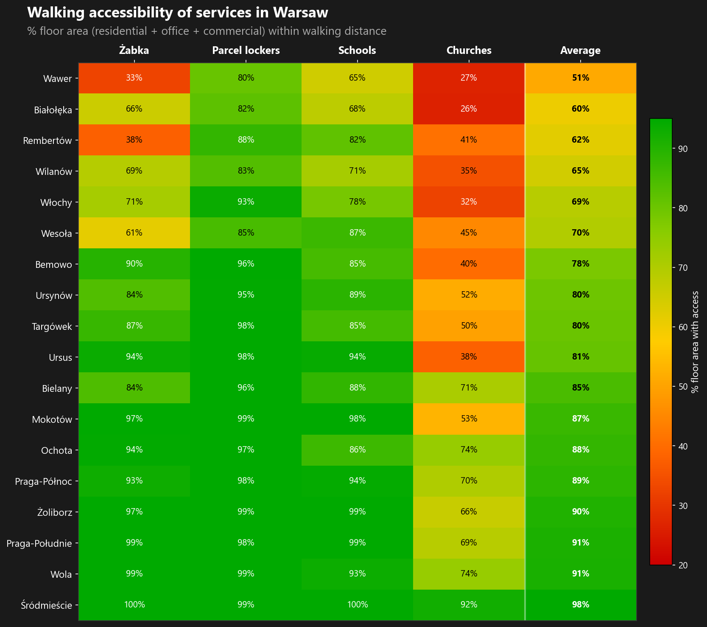
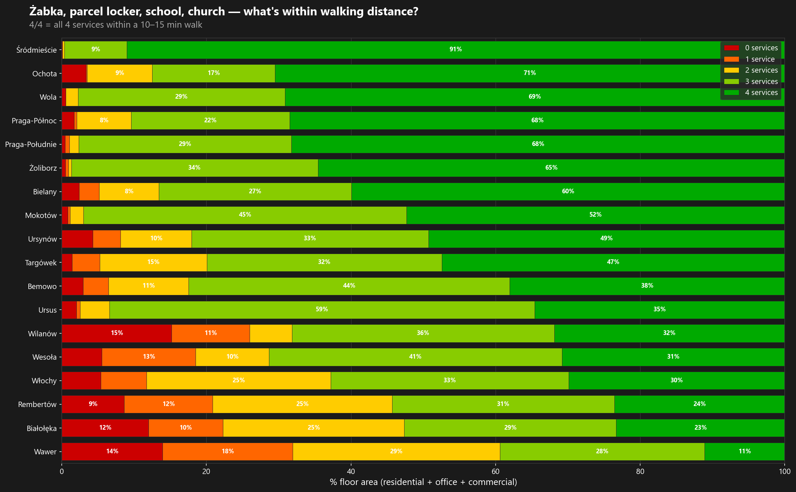
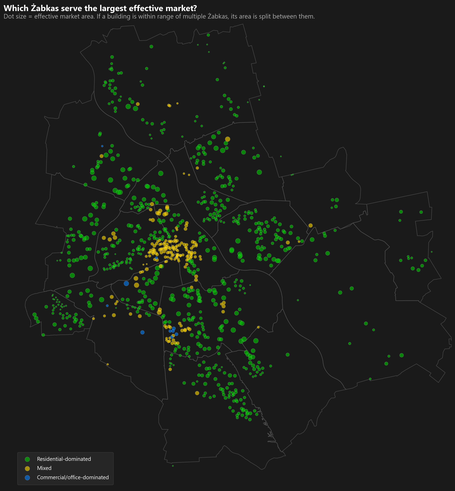

# Warsaw Walking Accessibility Analysis

Isochrone-based walking accessibility analysis for Warsaw, Poland. Generates coverage maps for multiple services and publication-ready analytical charts.

**155,000 buildings analyzed. Floor-area weighted. Built with OpenStreetMap, BDOT10k, Python and QGIS.**

## Maps

| | |
|---|---|
|  |  |
|  |  |

## Charts

### Walking accessibility heatmap


### Service coverage pyramid


### Effective market per Żabka


## Services analyzed

| Service | Walk time | Color |
|---------|-----------|-------|
| Żabka (convenience stores) | 10 min | Green |
| Parcel lockers (InPost, DHL, etc.) | 10 min | Blue |
| Elementary schools | 15 min | Orange |
| Churches (Roman Catholic) | 10 min | Pink |

## Pipeline

Run scripts in order. Each step reads the output of the previous one.

```
00_fetch_boundaries.py           Fetch Warsaw admin boundaries from OSM
01_fetch_poi_osm.py              Fetch POI locations from OpenStreetMap
02_fetch_walking_network.py      Download walking network for Warsaw (one-time)
03_generate_isochrones_local.py  Generate 10/15-min walking isochrones per POI
04_create_coverage_map.py        Merge isochrones into coverage heatmap
05_intersect_buildings.py        Spatial join: buildings x coverage
06_classify_buildings.py         Classify all Warsaw buildings using BDOT10k
07_generate_charts.py            Generate the 3 publication charts
```

### Quick start

```bash
# 1. Fetch admin boundaries and walking network (one-time)
python 00_fetch_boundaries.py
python 02_fetch_walking_network.py

# 2. Download BDOT10k building footprints manually (see Data sources below)
# Place as: ../data/bdot/bdot_buildings_warsaw.gpkg

# 3. Run pipeline for all enabled services
python run_pipeline.py

# 4. Classify buildings across all services
python 06_classify_buildings.py

# 5. Generate charts
python 07_generate_charts.py
```

### Run a single service

```bash
python run_pipeline.py zabka
python run_pipeline.py church
```

## Project structure

```
00-07_*.py                   Pipeline scripts (run in order)
poi_config.py                Service definitions and configuration
building_categories.py       BDOT10k building type mappings
run_pipeline.py              Batch runner for 01-05 across all services
generate_qgis_styles.py      Generate QGIS layer styles from data

../data/                     Sibling folder (outside repo)
  osm/                       Admin boundaries (fetched by 00_fetch_boundaries.py)
  bdot/                      BDOT10k building footprints (manual download)
styles/                      QGIS QML style files
output/
  charts/                    Final publication charts (3 PNGs, tracked)
  maps/                      QGIS-exported map images (tracked)
  gpkg/                      Generated geodata (gitignored, ~2 GB)
network/                     Cached walking network (gitignored, ~470 MB)
```

## How it works

### Isochrone generation
- Walking network from OSMnx
- Walking speed: 4.5 km/h
- Node + edge buffering (50m) for gap-free coverage
- CRS: EPSG:2180 (Poland CS92)

### Coverage map
- Planar subdivision: merge all isochrone boundaries, polygonize, count overlaps
- Each polygon gets a `num_points` attribute = number of reachable POIs

### Building classification
- BDOT10k building footprints for Warsaw (~155k buildings)
- Floor area estimated from footprint area x number of floors
- Spatial join with coverage maps for all 4 services

### Effective market metric (chart 3)
- For each Żabka, find all buildings within its 10-min isochrone
- Count how many other Żabkas also reach each building
- Split each building's floor area equally among competing stores
- Sum to get each store's "effective market area"

## Data sources

- **POI locations**: OpenStreetMap via Overpass API (fetched by `01`)
- **Walking network**: OpenStreetMap via OSMnx (fetched by `02`)
- **District boundaries**: OpenStreetMap admin boundaries (fetched by `00`)
- **Building footprints**: [BDOT10k](https://mapy.geoportal.gov.pl/) (Polish national topographic database) — download manually and place in `../data/bdot/`

## Dependencies

```
geopandas
osmnx
networkx
shapely
pandas
numpy
matplotlib
scipy
requests
```

## License

Map data © OpenStreetMap contributors. Building data © GUGiK (BDOT10k).
